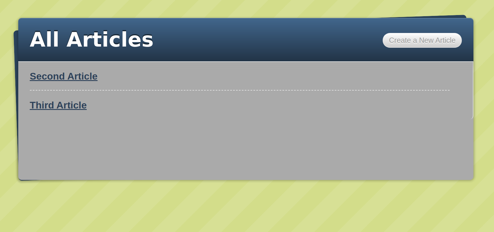

# Blog App

## About the project

Getting used to MVC structure, creating a blog app from scratch using ruby on rails, and working with associations, validations, models, helpers, and views.

- Models, Views, and Controllers (MVC)
- Data Structures & Relationships
- Routing
- Migrations
- Views with forms, partials, and helpers
- RESTful design

## Built With

- Ruby on Rails
- HTML
- CSS

## Getting Started

\*\*To get a local copy up and running follow these simple steps.

### Instructions

- Open the console
- Download or `git clone https://github.com/AlanSoto31/Blog-App.git`
- `cd Blog-App`
- run `bundle install`
- run `yarn install`
- run `rails server`
- run in the browser `http://localhost:3000/articles`

### Install

- yarn
- Ruby
- Ruby on Rails
- Text Editor

## Authors

👤 **Will Nyamunokora**

- Github: [@githubhandle](https://github.com/bigwizzo)
- Twitter: [@twitterhandle](https://twitter.com/willnyamunokora)
- Linkedin: [linkedin](https://linkedin.com/in/willnyamunokora)

👤 **Alan Soto**

- Github: [@githubhandle](https://github.com/)
- Twitter: [@twitterhandle](https://twitter.com/)
- Linkedin: [linkedin](https://www.linkedin.com/in/)

## 🤝 Contributing

Contributions, issues and feature requests are welcome!

Feel free to check the [issues page](https://github.com/AlanSoto31/Blog-App/issues).

## Show your support

Give a ⭐️ if you like this project!

## 📝 License

This project is [MIT](./LICENSE) licensed.
